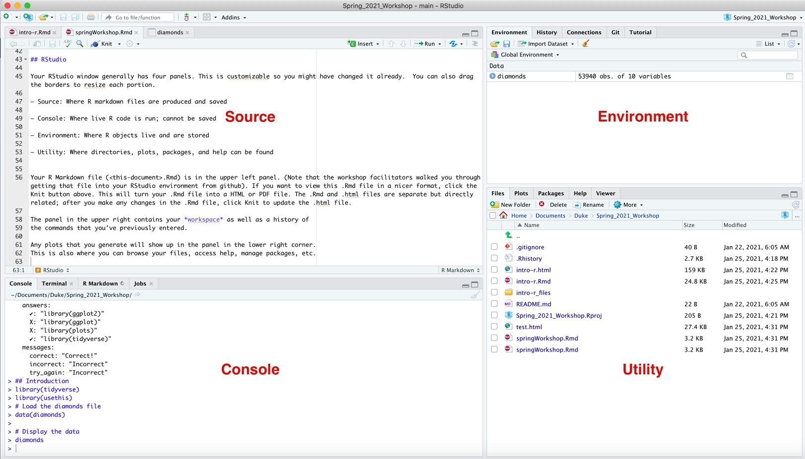
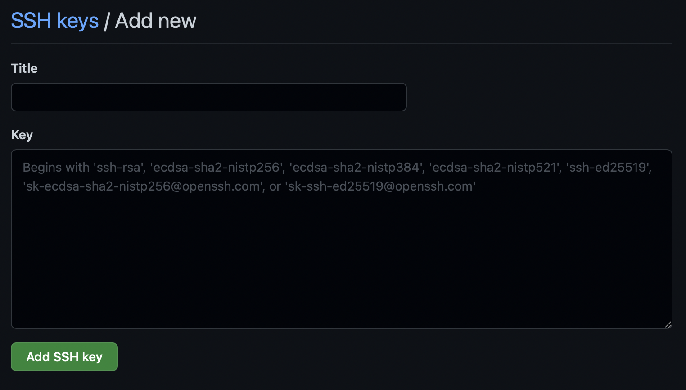
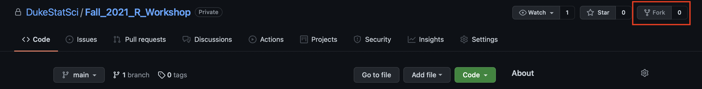
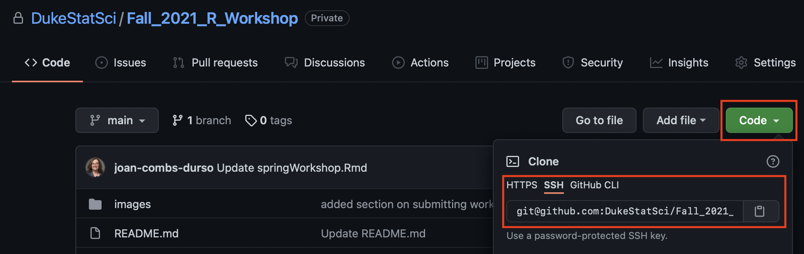
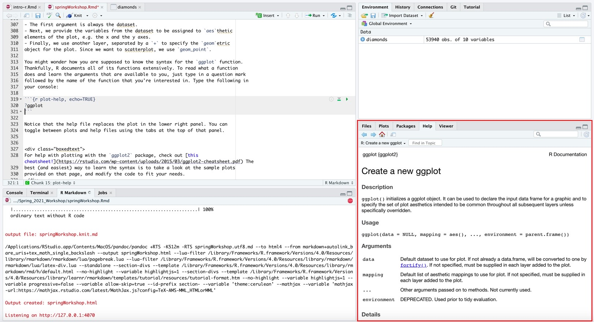
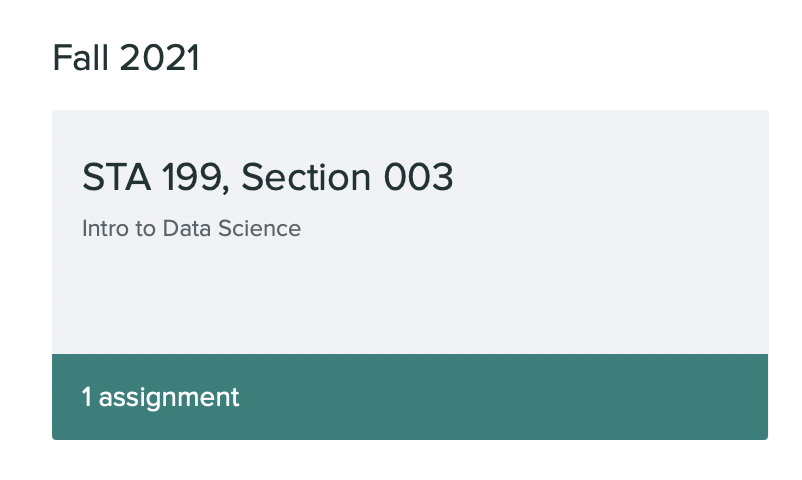

```{r setup, include=FALSE}
#library(learnr)
library(tidyverse)
knitr::opts_chunk$set(echo = FALSE)
```

## Introduction

This workshop is for students new to R and RStudio. 

Your introductory StatSci course this semester will march you through a thorough introduction to using R for statistical science and data science purposes, as well as for many other practical applications.  You should already be familiar with the environment you are going to use for your course, whether it is RStudio in the Cloud, a Docker container, or software installed on your own computer. Your instructor should have given you that information and you should be ready to use it.  

The materials here are a compilation of advice and instructions from your professors, TAs including Meredith Brown, and many helpful resources.  

Here are some key ideas:

* Everyone can learn R! It is very user-friendly, so do not be intimidated!

* R is an open source programming language for statistical computing (http://cran-r-project.org).

* RStudio is the IDE or Interactive Development Environment we use to work in R. RStudio is available open source, but their company also provides some cloud-based servers for working in their environment, known as RStudio in the Cloud.

## Getting Started

### Creating a GitHub Account

If you have not ever used GitHub, you will first need to go in and create an account. You will use GitHub to obtain the RMarkdown or .Rmd file for this workshop. If you already have a GitHub account, great! If not, take a minute to create one. But first, some username advice:

* Try to incorporate your name!

* Remember that horrible Snapchat username you made in middle school? Don't do that again. Make your username something you will feel comfortable sharing with future employers!

* Make it short and sweet!

After creating your account, **write down your username and password**.


## RStudio

Your RStudio window generally has four panels. This is customizable so you might have changed it already.  You can also drag the borders to resize each portion.

* **Source**: Where R markdown files are produced and saved

* **Console**: Where live R code is run; cannot be saved

* **Environment**: Where R objects live and are stored

* **Utility**: Where directories, plots, packages, and help can be found

{width=90%}

Your R Markdown file (<this-document>.Rmd) is in the upper left panel. If you want to view this .Rmd file in a nicer format, click the Knit button above. This will turn your .Rmd file into a HTML or PDF file. The .Rmd and .html files are separate but directly related; after you make any changes in the .Rmd file, click Knit to update the .html file. 

The panel in the upper right contains any data you have loaded, as well as a history of 
the commands that you've previously entered. You can also use the **Git** interface in this panel.

Any plots that you generate will show up in the panel in the lower right corner. 
This is also where you can browse your files, access help, manage packages, etc.

Your console, in the bottom left panel, can be used to run code. Do this with caution as your code will not be saved. 

## R Packages

R is an open-source programming language, meaning that users can contribute
packages that make our lives easier, and we can use them for free. For this workshop,
and many others in the future, we will use the following R packages:

- `tidyverse`: A group of packages for data manipulation, exploration and visualization that share a common coding syntax and style.
- `dplyr`: A package in the tidyverse for data wrangling
- `ggplot2`: A package in the tidyverse for data visualization

These packages and most packages you will use for your courses have been preinstalled 
in the docker containers for you. In the future, if you download RStudio locally or wish
to install new packages for your personal use, uou can install packages using commands like 
`install.packages` and `install_github`. Find out more about the tidyverse [here.](https://rviews.rstudio.com/2017/06/08/what-is-the-tidyverse/)

Next, you need to load the packages in your working environment. We do this with
the `library` function. Note that you only need to **install** packages once, but
you need to **load** them each time you relaunch RStudio.

```{r load-packages, eval = TRUE, echo = TRUE, message = FALSE, warning = FALSE}
library(tidyverse)
library(usethis)
```

To do so, you can: 

* Click on the green arrow at the top of the code chunk in the R Markdown (Rmd) 
file
* Highlight these lines, and hit the **Run** button on the upper right corner of the 
pane, or
* Hit `CTRL` + `ENTER` to run the current line of code
* Hit `CTRL` + `SHIFT` + `ENTER` to run the current chunk of code
* Type the code in the console.
  + Note: Running code in the console is useful for testing code and seeing the current status of variables,
  but any code that you want in your final .Rmd file should be put in a code chunk in the .Rmd.

Going forward you will be asked to load any relevant packages at the beginning
of each lab.

## Github and RStudio

### Authenticating with SSH

Git is used to integrate GitHub and Version Control into your RStudio IDE. 

To connect to Github, do the following:

1. In the console of the docker container, type `credentials::ssh_setup_github()`. R will ask “No SSH key found. Generate one now?” You should **click 1 for yes**.
2. You will generate a key. It will begin with “ssh-rsa...” R will then ask “Would you like to open a browser now?” You should **click 1 for yes**.
3. In Github in the browser, give your key a name and **paste the generated key**. Hit save and refresh Github. 
4. This process will only need to be done one time for your container.

{width=50%}

### Configure your GitHub Account

You will use the `use_git_config()` function from the `usethis` package.

Type the following lines of code in the console in RStudio filling in your name and email address.

The email address is the one tied to your GitHub account.
```{r get your github congfigured, echo=TRUE, eval=FALSE}
library(usethis)
use_git_config(user.name = "GitHub username", user.email="your email")
```

For example, Meredith's would be:

```{r github-usethis-ex, echo=TRUE, eval = FALSE}
library(usethis)
use_git_config(user.name="meredithb3", user.email="meredith.brown@duke.edu")
```

Take a minute to configure your GitHub account into RStudio!

### Fork and Clone Fall Workshop

Now on GitHub, search for the following repository: https://github.com/DukeStatSci/Fall_2021_R_Workshop 

First, **Fork** the repository by clicking Fork in the upper right-hand portion of the screen. Forking allows you to make changes to the repository with Version Control, without changing the repository for others. 


{width=90%}


Click on the green `Code` button and then click on the clipboard icon next to the URL to copy the repository link. Make sure to copy the URL corresponding to the `SSH` tab.


{width=90%}

Now open your RStudio window.

Click `File` $\rightarrow$ `New Project` $\rightarrow$ `Version Control` $\rightarrow$ `Git` and hit `paste` in the `Repository URL` field. 

- You will need to select a location to store this project. Good coding practice suggests creating a folder for your class, and then subfolders for labs, homeworks, etc.

Now click `Create Project`. 

To view the output that I am currently sharing with you, click on the file `fallWorkshop.Rmd` and click **Knit** on the file.

## Diving into the Data

We are going to use a dataset called `diamonds`. This dataset can be found in the `ggplot2` package! Simply run  `library(tidyverse)` or `library(ggplot2)` if you haven't already, and then call `data(diamonds)` to load in the dataset.
To get you started, run the following command to load the data and to inspect the first ten rows of the file.

```{r load-diamonds-data, echo = TRUE}
# Load the diamonds file
data(diamonds)

# Display the data
diamonds
```

To do so, once again, you can 

* click on the green arrow at the top of the code chunk in the R Markdown (Rmd) 
file, or
* put your cursor on this line, and hit the **Run** button on the upper right 
corner of the pane, or
* type the code in the console.

This command instructs R to load some data.  You should see that the workspace area in the upper righthand corner of the RStudio window now lists a data set called `diamonds` that has 
53940 observations on 10 variables. As you interact with R, you will create a series of objects. Sometimes you load them as we have done here, and sometimes you create them yourself as the byproduct of a computation or some analysis you have performed.

However printing the whole dataset in the console is not that useful. 
One advantage of RStudio is that it comes with a built-in data viewer. Click on
the name `diamonds` in the *Environment* pane (upper right window) that lists 
the objects in your workspace. This will bring up an alternative display of the 
data set in the *Data Viewer* (upper left window). You can close the data viewer
by clicking on the *x* in the upper lefthand corner.

What you should see are ten columns of data, each row representing a 
different diamond: the first entry in each row is simply the row number (an index 
we can use to access the data from individual stones if we want), the second is 
price in dollars, and the third is the weight in carats of that gem.
Use the scrollbar on the right side of the console 
window to examine the complete data set.

Note that the row numbers in the first column are not part of the `diamonds` data. 
R adds them as part of its printout to help you make visual comparisons. You can
think of them as the index that you see on the left side of a spreadsheet. In 
fact, the comparison to a spreadsheet will generally be helpful. R has stored 
the 'diamonds' data in a kind of spreadsheet or table called a *data frame*.

You can see the dimensions of this data frame by typing:

```{r dim-data, echo = TRUE}
dim(diamonds)
```

This command should output `[1] 53940 10`, indicating that there are 53940 rows or observations and 10 columns or fieldnames. 
You can see the names of these columns (or variables) by typing:

```{r names-data, echo=TRUE}
names(diamonds)
```


**Exercise:** What are some of the values for `cut` included in this dataset? 

Hint: Take a look at the `cut` variable in the Data Viewer to answer this question.

You should see that the data frame contains the columns `price`,  `carat`, and 
`cut`. At this point, you might notice that many of the commands in R look a 
lot like functions from math class; that is, invoking R commands means supplying
a function with some number of arguments. The `dim` and `names` commands, for 
example, each took a single argument, the name of a data frame.

**Tip: ** If you use the up and down arrow keys, you can scroll through your 
previous commands, your so-called command history. You can also access it 
by clicking on the history tab in the upper right panel. This will save 
you a lot of typing in the future.

## R Markdown

The console is a greatplace for playing around with code, however it is not a good place for 
documenting your work. Working in the console exclusively makes it difficult to 
document your work as you go, and reproduce it later. 

R Markdown is a great solution for this problem. And, you already have worked with 
an R Markdown document -- this lab! Type code in the code chunks provided in the R Markdown (Rmd) document, and **Knit**
the document to see the results.  Knit should produce an HTML file for you that 
lets you view the output of your code.

## Data Exploration

Let's start to examine the data a little more closely. 
To find out more about this dataset, you could use some help.  Try typing the name of the dataset with a '?' in front of it.

```{r help-diamonds, exercise=TRUE}

```

You should see the documentation on the dataset in the Help window.  Try out the other tabs there briefly.  
We can access the data in a single column of a data frame separately using a command like

```{r view-clarity, exercise=TRUE}
diamonds %>%
  select(clarity) %>%
  slice(1:100)
```


The `%>%` operator is called the **piping** 
operator. Basically, it takes the output of the current line and tells R to continue into 
the following line of code. Reading the code in plain English: From the diamonds data frame, we select the column `clarity`. We want the first 100 rows of the column `clarity`.

**Try selecting a different column to observe and only view the first 50 rows.**

```{r new-column, exercise=TRUE}
?diamonds
```

### Mutate

We can create new columns in our data frame through the `mutate()` function. 

```{r new-columns, exercise = TRUE}
diamonds <- diamonds %>%
  mutate(total = x + y + z)

diamonds
```

Notice the new column on the end of our table?

### Filtering 

We can use just part of the dataset by filtering. Here, we are going to filter on a particular value of cut and color. Try filtering another variable.

```{r try-filtering-diamonds, exercise = TRUE}
diamonds %>%
  filter(cut == "Fair" & color =="G")
```


### Booleans

In addition to simple mathematical operators like subtraction and 
division, you can ask R to make logical comparisons like greater than, `>`, less than,
`<`, and equality, `==`. For example, we can ask if the x dimension is greater than 
the y dimension for these stones with the expression

```{r x-greater-than-y, exercise = TRUE}
diamonds %>%
  mutate(more_x = x > y)
```

This command add a new variable to the `diamonds` data frame containing the values
of either `TRUE` if that stone was longer than its width, or `FALSE` if it was not (the answer may surprise you). 

This variable contains different kind of 
data than we have considered so far. All other columns in the `diamonds` data 
frame have values that are numerical (carat, table and width) or text (color, cut). Here, 
we've asked R to create *logical* data, data where the values are either `TRUE` 
or `FALSE`. In general, data analysis will involve many different kinds of data 
types, and one reason for using R is that it is able to represent and compute 
with many of them.

## Data Visualization

R has some powerful functions for making graphics. We can create a simple plot 
of the price of diamonds by their weight measured in carats with the command

```{r plot-price-vs-carat, echo=TRUE}
ggplot(data = diamonds, aes(x = carat, y = price, color = cut)) +
  geom_point() +
  theme_classic() +
  labs(title = "Carat vs. Price",
       subtitle = "RStudio Spring Workshop",
       caption = "Data Source: Diamonds Dataset",
       x = "Carat",
       y = "Price ($)",
       color = "Cut")
```


We use the `ggplot()` function to build plots. If you run the 
plotting code in your console, you should see the plot appear under the *Plots* tab 
of the lower right panel of RStudio. Notice that the command above again looks like 
a function, this time with arguments separated by commas. 

* The first argument is always the dataset: `data = diamonds` in this case 
* Provide the variables from the dataset to be assigned to `aes`thetic 
elements of the plot, e.g. the x and the y axes. 
* Use another layer, separated by a `+` to specify the `geom`etric 
object for the plot. Since we want to scatterplot, we use `geom_point`.
* Add a theme to your plot to make it look professional: `theme_classic()`
* Finally, add labels through `labs()`

The graph looks nice, but is pretty cluttered! If we want to graph a **categorical variable** such as `cut`, we can use boxplots. 

```{r better-plots-2, echo=TRUE}
ggplot(data = diamonds, aes(x = cut, y = price, fill = cut)) +
  geom_boxplot() +
  theme_minimal() +
  labs(title = 'Cut vs. Price',
       subtitle = 'RStudio Spring Workshop',
       caption = 'Diamonds Dataset',
       x = "",
       y = "Price ($)",
       fill = "Cut")
```


You might wonder how you are supposed to know the syntax for the `ggplot` function. 
Thankfully, R documents all of its functions extensively. To read what a function 
does and learn the arguments that are available to you, just type in a question mark 
followed by the name of the function that you're interested in. Type the following in
your console:

```{r plot-help, echo=TRUE}
?ggplot
```

{width=90%}

Notice that the help file replaces the plot in the lower right panel. You can 
toggle between plots and help files using the tabs at the top of that panel. 

**Exercise:** Now play with mutate and piping and create a plot of interest to you. What is the difference between calling `fill = cut` and `color = cut`? 

```{r plot-of-something-interesting, eval=FALSE}
ggplot(data = "____", aes(x = "____", y = "____")) +
  "____"
```


For help with plotting with the `ggplot2` package, check out [this cheatsheet!](https://rstudio.com/wp-content/uploads/2015/03/ggplot2-cheatsheet.pdf) The 
best (and easiest) way to learn the syntax is to take a look at the sample plots 
provided on that page, and modify the code to fit your needs. 

## Submitting Your Work

Now that you've gotten some practice coding - let's go over how to submit your work for classes. Your professors will most likely ask for your final **PDF** file. We will briefly go over how to create these outputs from an .Rmd file.

Turning your assignment can be accomplished from the following steps.

1. Once you are finished with the assignment, **Knit** the file.
2. Select all updated files in the **Git** tab of the **Environment** pane.
3. **Commit** the files with an informative title, and **push** the files to Github.
4. Go to your class's Gradescope page. **Submit the PDF** of your assignment. 
5. **Select** the page each exercise is associated with.
6. Done!

{width=50%}

## Troubleshooting

Sometimes, your code will work in your .Rmd but will not compile. This is because when you **knit**, your machine is running the code line by line. If one of your lines of code was entered in the console instead of in the file, uses a variable not created until later in your document, repeats a code chunk name, or possesses any other fault, you will run into an error. 

R provides thorough error messages letting you know the issue at hand. Very often, it is because the data or a package is not loaded into the file. There are a lot of great resources online for troubleshooting error messages. Sites like **Stack Overflow** https://stackoverflow.com/questions/tagged/rstudio provide lots of resources and answers to questions people have already asked. Likewise, your TA and professors are here to help! If you cannot find a solution online, post your code (privately) and error message on your **Ed Discussion board**, or visit your professor/TA's office hours. 

## Resources for Learning R

That was a short introduction to R and RStudio, but your instructors will provide you with more functions and a more complete sense of the language as your course progresses. You 
might find the following tips and resources helpful.

* Many courses use the Tidyverse while other courses will expect you to learn to work in base R, rather than in the RStudio IDE. In Tidyverse-flavored courses, you will use  `dplyr` (for data wrangling) and `ggplot2` (for 
data visualization) extensively. If you are googling for R code, make sure
to also include these package names in your search query. For example, instead
of googling "scatterplot in R", google "scatterplot in R with ggplot2".

* Duke offers Coursera courses for free to Duke students through this link: https://online.duke.edu/coursera-for-duke/

* There is a terrific resource on Medium called Towards Data Science, and you can find good information there, although you may have a limited number of free articles to read. https://towardsdatascience.com/data-science/home

* Do a quick search on "Free books on R" and you will find a huge array of choices. 

* Lots of R users post their own guides that you can find by searching. Here's one from David Romney at Harvard: https://scholar.harvard.edu/dromney/online-resources-learning-r

* The r-statistics blog is very helpful: https://www.r-statistics.com/  In fact, you will find that the R community by its very nature is beginner friendly.  

* The following cheatsheets may come in handy throughout your courses. Note that some 
of the code on these cheatsheets may be too advanced for your needs now, however the
majority of it will become useful as you progress through your statistical science courses.
    - [Data wrangling cheatsheet](http://www.rstudio.com/wp-content/uploads/2015/02/data-wrangling-cheatsheet.pdf)
    - [Data visualization cheatsheet](https://github.com/rstudio/cheatsheets/raw/master/data-visualization-2.1.pdf)
    - [R Markdown](https://github.com/rstudio/cheatsheets/raw/master/rmarkdown-2.0.pdf)

## Acknowledgements
This is derived from the `Learning R Tutorials` website. Thanks to Joan Durso and Maria Tackett for all their help!
